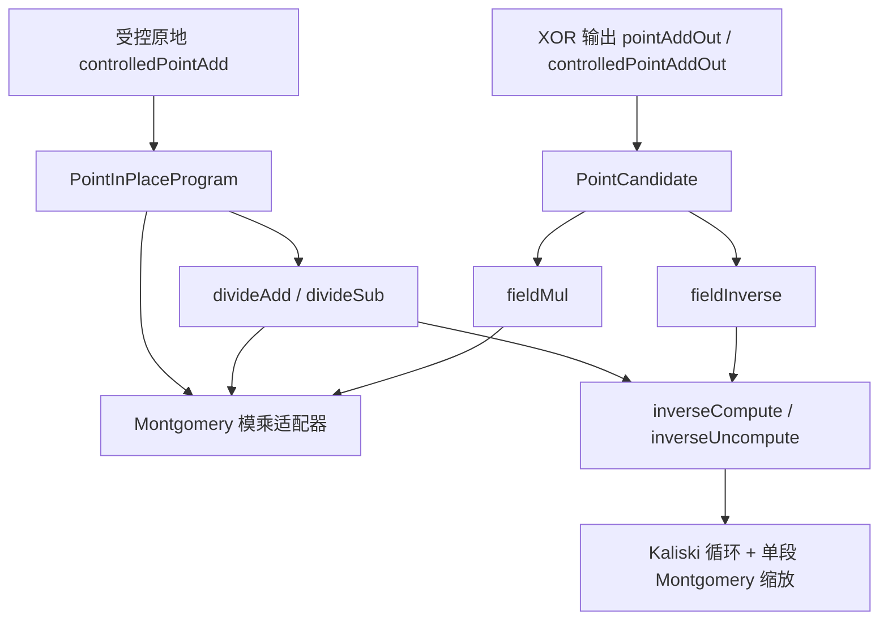

# 项目地图：从哪里开始读

这个项目在 Lean 中构造 secp256k1 点加电路，并证明它算对了、工作位清零了、相位恢复了，以及用了多少门和线路。最终入口是 `controlledPointAdd`：控制位为真时把点 `R` 更新为 `R+C`，否则保留 `R`；`C` 是构造电路时已知的常量点。

第一次阅读，先看下面的任务表。需要理解求逆时，直接进入[求逆模块说明](modules/inverse.md)。本页按职责组织阅读路径，源码仍保留在原目录；其他模块的独立说明尚未编写，表中的源码入口现在就可使用。

核对代码基线：`6bdfc69dde84cc089f94edde70c441fc0e309b60`，2026-09-14。后续涉及入口或调用关系的修改，应在同一 PR 更新本页及基线。

## 我想做什么，先读哪里

| 你的任务 | 第一站 | 什么时候继续深入 |
| --- | --- | --- |
| 理解项目最终证明了什么 | [ControlledPointAddSpec.lean](../ECDSAAdd/Arithmetic/ControlledPointAddSpec.lean) 的 `controlledPointAdd_spec` | 想知道如何实现，再看 `ControlledPointLayout.lean` → `PointInPlaceProgram.lean` |
| 学会读 `{{ 前提 }} 程序 {{ 结果 }}` | [Hoare.lean](../ECDSAAdd/Framework/Hoare.lean) 的 `Holds`、`Triple` | 修改语义或组合证明时，再读 `Semantics.lean` 和 `Triple.seq/frame` |
| 使用逆元或修改求逆 | [求逆模块说明](modules/inverse.md) | 先区分完整输出与准备/恢复两个接口，再选阅读路线 |
| 使用模乘 | [FieldMultiply.lean](../ECDSAAdd/Arithmetic/FieldMultiply.lean) 的 `fieldMul_zero_spec` / `fieldMul_spec` | 需要累加、受控接口或修改实现，再读 `MontAdapterSpec.lean` |
| 把分子除以分母后累加到目标 | [DivideSpec.lean](../ECDSAAdd/Arithmetic/DivideSpec.lean) 的 `divideAdd_spec` / `divideSub_spec` | 修改共享工作区时，再看 `Divide.lean` 与求逆说明的借用规则 |
| 查看当前成本或证明范围 | [PROOF_STATUS.md](PROOF_STATUS.md) 和相应 `Resources.lean` | 需要追溯数字，再沿具体程序的计数与支持集证明向下读 |
| 找优化方案的来历 | [REWORK_PLAN.md](REWORK_PLAN.md) | 这是设计与历史记录；当前实现以程序定义和规格为准 |

调用者确认前提和保证足够后，就可以用公开定理组合证明。修改模块内部时，再展开其布局、状态和证明文件；无需先通读整个 `Arithmetic`。

## 先认识几个常用词

| 代码中的词 | 在这个项目中的意思 |
| --- | --- |
| `Program` | 一串门和测量指令；定义见 [Syntax.lean](../ECDSAAdd/Framework/Syntax.lean) |
| `Layout` / `Widths` / `Nodup` | 线路如何组成寄存器 / 寄存器位宽要求 / 线路列表中没有重复编号 |
| `Spec` / `Triple` | 在指定初始寄存器值下，程序结束时保证哪些值；`Triple` 还要求所有测量记录下相位恢复 |
| `work=0` | 列出的工作寄存器全零；保证适用于定理指定的程序边界，并非任意中间时刻 |
| XOR 输出 | 保留输入，把结果按位异或进输出；输出初始为零时得到结果，已有相同结果时可将其清零 |
| 原地更新 | 直接改变目标寄存器；例如模加是 `Z → (Z+X)%p`，不是按位 XOR |
| `Frame` / `Support` / `Resources` | 如何保持其他状态 / 门列实际触及哪些线路 / 同一程序的精确资源 |

模型使用带符号的计算基态分支，测量结果只选择即时相位修正；本文不把它扩展解释成完整的一般量子态语义。`qubitCount` 是实际静态线路并集的大小，不等同于布局分配总数或最大同时存活数，见 [Cost.lean](../ECDSAAdd/Framework/Cost.lean)。

## 按职责找到模块

`ECDSAAdd/Math` 主要证明数学算法和曲线性质，`Framework` 定义程序及判断含义，`Circuit` 和 `Arithmetic` 构造电路并证明其行为。下面是阅读分组，不是逐文件归属清单或完整 import 图。

| 模块 | 它负责什么 | 使用入口；需要修改时继续读 |
| --- | --- | --- |
| 语义与证明框架 | 门如何执行、规格如何组合、资源如何计数 | [Hoare](../ECDSAAdd/Framework/Hoare.lean)；[Syntax](../ECDSAAdd/Framework/Syntax.lean)、[Semantics](../ECDSAAdd/Framework/Semantics.lean)、[Cost](../ECDSAAdd/Framework/Cost.lean) |
| 曲线数学 | secp256k1 的域、点和完整群律；原地点加所需等式 | [BitcoinCurve](../ECDSAAdd/Math/BitcoinCurve.lean)、[AffineFormula](../ECDSAAdd/Math/AffineFormula.lean)；[BitcoinPrimes](../ECDSAAdd/Math/BitcoinPrimes.lean)、[PointInPlace](../ECDSAAdd/Math/PointInPlace.lean) |
| 基础电路 | 加减、比较、零检测、复制、移位及测量清理 | [InPlaceAdder](../ECDSAAdd/Arithmetic/InPlaceAdder.lean)、[Compare](../ECDSAAdd/Arithmetic/Compare.lean)；[And](../ECDSAAdd/Circuit/And.lean)、[MeasuredMaskedAdder](../ECDSAAdd/Arithmetic/MeasuredMaskedAdder.lean)、[ZeroControl](../ECDSAAdd/Arithmetic/ZeroControl.lean) |
| 模加减与半倍 | 带范围前提的模运算、原地及受控接口 | [FieldAddSub](../ECDSAAdd/Arithmetic/FieldAddSub.lean)、[ModInPlaceSubtract](../ECDSAAdd/Arithmetic/ModInPlaceSubtract.lean)；[ModInPlaceWrappers](../ECDSAAdd/Arithmetic/ModInPlaceWrappers.lean)、[ModUnaryResources](../ECDSAAdd/Arithmetic/ModUnaryResources.lean) |
| Montgomery 模乘 | 分段计算模乘，保留历史供恢复，并提供多种输出接口 | [FieldMultiply](../ECDSAAdd/Arithmetic/FieldMultiply.lean)、[MontAdapterSpec](../ECDSAAdd/Arithmetic/MontAdapterSpec.lean)；[MontPQ](../ECDSAAdd/Arithmetic/MontPQ.lean)、[MontPrepare](../ECDSAAdd/Arithmetic/MontPrepare.lean)、[MontLayout](../ECDSAAdd/Arithmetic/MontLayout.lean) |
| 求逆 | Kaliski 循环、缩放、完整逆元输出及准备/恢复 | [模块说明](modules/inverse.md)；[InverseSpec](../ECDSAAdd/Arithmetic/InverseSpec.lean)、[InverseLoopSpec](../ECDSAAdd/Arithmetic/InverseLoopSpec.lean) |
| 除法 | 使用逆元将分子/分母受控加减到目标，随后清理 | [DivideSpec](../ECDSAAdd/Arithmetic/DivideSpec.lean)；[Divide](../ECDSAAdd/Arithmetic/Divide.lean)、[DivideProduct](../ECDSAAdd/Arithmetic/DivideProduct.lean)、[DivideState](../ECDSAAdd/Arithmetic/DivideState.lean) |
| 点加 | 点的分类、坐标运算、特殊情况和最终清理 | [ControlledPointAddSpec](../ECDSAAdd/Arithmetic/ControlledPointAddSpec.lean)、[PointAddSpec](../ECDSAAdd/Arithmetic/PointAddSpec.lean)；两条路径见下节 |

算术的数学依据随相应模块追踪：例如求逆读 `Math/Kaliski*` 与 `Math/InverseScaleFactor.lean`，模乘读 `Math/Montgomery*.lean`。名字带 `Math` 的结论本身不证明线路清理或门数。

## 点加有两条当前路径

普通点加的候选法与受控原地法同时保留，入口不同。以下表示运行时调用关系，省略分类、装卸和清理细节；不是 Lean 的 import 图。

两条路径还依赖模加减、基础电路和曲线数学。对应源码：[ControlledPointLayout](../ECDSAAdd/Arithmetic/ControlledPointLayout.lean)、[PointInPlaceProgram](../ECDSAAdd/Arithmetic/PointInPlaceProgram.lean)、[PointOutput](../ECDSAAdd/Arithmetic/PointOutput.lean)、[PointCandidate](../ECDSAAdd/Arithmetic/PointCandidate.lean)。有限常量走上面的算术路径；无穷远常量由构造期分支单独处理。

这也解释了模乘变化为什么会影响多个地方：既影响候选法，又影响除法和原地点加，还可能影响求逆中的 Montgomery 缩放。缩放直接调用单段内核，不能用完整 `fieldMul` 的成本代替。可从 [MontResources](../ECDSAAdd/Arithmetic/MontResources.lean)、[InverseLoopResources](../ECDSAAdd/Arithmetic/InverseLoopResources.lean)、[DivideResources](../ECDSAAdd/Arithmetic/DivideResources.lean)、[PointCandidateResources](../ECDSAAdd/Arithmetic/PointCandidateResources.lean)、[PointInPlaceResources](../ECDSAAdd/Arithmetic/PointInPlaceResources.lean) 追到 [ControlledPointResources](../ECDSAAdd/Arithmetic/ControlledPointResources.lean)。具体影响取决于改动的是适配器还是共用内核。

## 修改与协作时的边界

模块边界首先是公共契约：调用者通常使用 `*_spec`，维护者负责布局、程序、证明和资源的一致性。`State` 保存证明需要的阶段条件；`Ports`、`PoolLayout` 和部分 `Layout` 把多个模块接到同一组线路上，属于跨模块接点。

| 修改范围 | 需要一起检查 |
| --- | --- |
| 模块内部算法或清理顺序 | 该模块的状态断言、规格、资源和介绍；上层是否依赖中间态 |
| 模乘/求逆公共接口 | 除法与两条点加路径的调用前提、证明和资源 |
| [PoolLayout](../ECDSAAdd/Arithmetic/PoolLayout.lean)、[InversePorts](../ECDSAAdd/Arithmetic/InversePorts.lean)、[PointInPlaceLayout](../ECDSAAdd/Arithmetic/PointInPlaceLayout.lean) 等共享布局 | 线路互异、借用关系、实际支持集；先与相关模块任务协调 |
| README、本地图、[总导入入口](../ECDSAAdd.lean)、验证脚本 | 跨模块导航和验证覆盖，交给本轮集成任务统一协调 |

本轮只维护 `new` 和唯一临时分支 `codex/module-map-inverse`。报告、文档和后续代码修改统一在临时分支累积，完成验证与审阅后再集成到 `new`。多个 agent 协作时先约定文件范围，由一个执行者负责 Git 操作；如需独立目录可用 detached worktree 交接补丁，不再为每项任务新建持久分支。任务开始时写清基线、目标和验证范围，实际合并沿用 README 的责任约定。

## 当前调用与已存在的其他组件

代码“已定义/已证明”和“已接入最终点加”是两件不同的事。当前完整求逆使用两位 `RoundRecord` 和 `scaling`。仓库也有 [OneBitRoundSpec](../ECDSAAdd/Arithmetic/OneBitRoundSpec.lean)、[InverseCompactViews](../ECDSAAdd/Arithmetic/InverseCompactViews.lean) 等组件；它们尚未替换上述完整程序，细节见[求逆说明](modules/inverse.md#维护者从哪里继续读)。

`ECDSAAdd.lean` 的 import 让声明进入环境，不说明某条电路已经调用这些声明。判断当前执行路径，应从 `def` 中的具体调用向下追踪。

## 验证与文档维护

Lean、import 或公共接口变化时，按 [scripts/verify.sh](../scripts/verify.sh) 执行 `lake --wfail build` 和公开定理传递公理检查，白名单保持 `propext`、`Classical.choice`、`Quot.sound`。新检出先按 README 获取固定版本 Mathlib 缓存。纯说明变更检查链接、陈述与源码的一致性及 diff；仓库现有 CI 仍会运行。

本页维护职责与入口；模块说明维护契约、阶段和修改路径；[PROOF_STATUS](PROOF_STATUS.md) 维护证明状态与资源证据；[REWORK_PLAN](REWORK_PLAN.md) 保留算法设计与历史；[PROVENANCE](PROVENANCE.md) 保留来源与复现条件。接口、调用关系或文件路径变化时，同一个 PR 更新对应说明，不在这里另建易过期的成本表。
